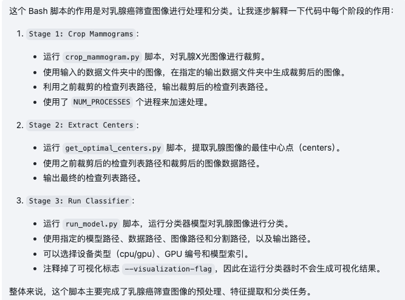
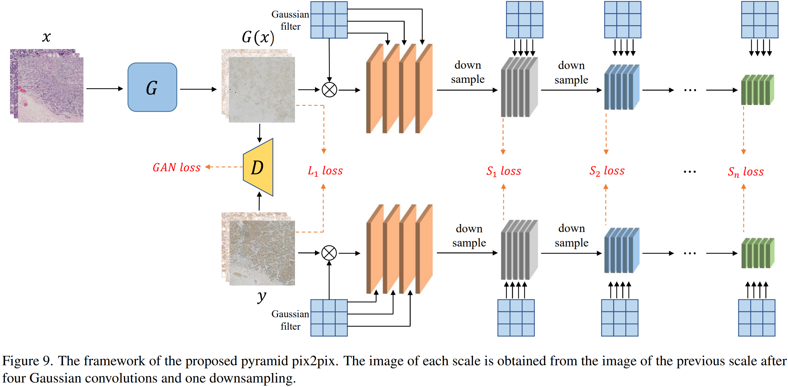

笔记：

> 今天下午就把这17篇论文和代码整理学习一下，把学习的笔记都记在这里，记得写分页符号，便于打印出来复习。
>
>  ~~果然看以前写的笔记还挺有意思的，根本没有写分页符号也没有打印出来复习，根本就没有学习哈哈。2024.06.03~~
>
> 论文的下载是从深度之眼里面下载的，所以pdf有水印，如果需要无水印的就直接搜索arXiv的标识就行了或者论文的标题。想来想去，笔记也写一个英文的翻译吧，反正不是我翻译。
>
> ~~后来啊，连翻译都不写了，以前写日记都得配一个英文更别说学术笔记了。2024.06.03~~
>
> ---
>
> This afternoon, I will organize and study these 17 papers and codes. Write down all the study notes here. Remember to write the page breaks so that you can print them out for review.
>
> The paper is downloaded from the Eye of Depth, so the pdf has a watermark. If you want one without watermark, just search for the arXiv logo or the title of the paper. After much deliberation, I decided to write an English translation in my notes. Anyway, I am not the one translating.

```txt
<div STYLE="page-break-after: always;"></div>
```

# 01.An interpretable classifier

> An interpretable classifier for high-resolution breast cancer screening images utilizing weakly supervised localization

>利用弱监督定位的高分辨率乳腺癌筛查图像的可解释分类器

> interpretable adj.可解释的
>
> high-resolution n.高分辨率
>
> utilize v.利用使用

>arXiv:2002.07613v1 [cs.CV] 13 Feb 2020
>
>https://arxiv.org/pdf/2002.07613

## Summary

- 该论文提出了一种***解释性分类器***，用于高分辨率乳腺癌筛查图像，并利用弱监督定位技术。乳腺癌是全球最常见的癌症之一，早期诊断对提高治愈率至关重要。然而，高分辨率乳腺筛查图像通常包含大量细节和复杂结构，使得准确的分类和定位成为挑战。

- 该论文的**主要贡献**是提出了一种基于弱监督学习的方法，该方法可以在没有详细标注的情况下训练乳腺癌分类器。与传统的监督学习方法相比，弱监督学习利用了只有图像级别标签的数据，而不需要详细的像素级别标注。同时，该方法还通过**生成类激活图**（Class Activation Map，CAM）来实现对乳腺癌病灶的定位，从而增加了解释性。

- 该论文的实验结果表明，所提出的方法在高分辨率乳腺筛查图像分类和病灶定位任务上取得了很好的性能。这种解释性分类器有助于医生理解分类的依据，并提供指导，以帮助更准确地诊断乳腺癌。

---

- The **main contribution** of this paper is to propose a method based on weakly supervised learning that can train a breast cancer classifier without detailed annotations. Compared with traditional supervised learning methods, weakly supervised learning utilizes data with only image-level labels, without requiring detailed pixel-level annotations. At the same time, this method also achieves the positioning of breast cancer lesions by generating a Class Activation Map (CAM), thereby increasing the interpretability.

---

Highlights of GMIC:

- **High Accuracy**: GMIC outperformed ResNet-34 and Faster R-CNN.
- **High Efficiency**: Compared to ResNet-34, GMIC has **28.8%** fewer parameters, uses **78.43%** less GPU memory and is **4.1x** faster during inference and **5.6x** faster during training.
- **Weakly Supervised Lesion Localization**: Despite being trained with only image-level labels indicating the presence of any benign or malignant lesion, GMIC is able to generate pixel-level saliency maps (shown below) that provide additional interpretability.

---

亮点：

- 高精度：GMIC 优于 ResNet-34 和 Faster R-CNN。
- 高效率：与 ResNet-34 相比，GMIC 的参数减少了 28.8%，使用的 GPU 内存减少了 78.43%，推理速度提高了 4.1 倍，训练速度提高了 5.6 倍。
- 弱监督病变定位：尽管仅使用指示任何良性或恶性病变存在的图像级标签进行训练，GMIC 仍能够生成提供额外可解释性的像素级显着性图（如下所示）。

---

## Architecture

总之就是把下面这个图片看懂就OK了。

---

In short, it’s OK to understand the picture below.

---

https://github.com/nyukat/GMIC/blob/master/mia_structure.png


>Fusion v.融合
>
>capacity n.容量
>
>Saliency adj.显著性的，明显的
>
>patch n.补丁，修补
>
>retrieve v.纠正，恢复
>
>folder n.文件夹
>
>buffer n.缓冲
>
>iteration n.迭代

## Code

下面看一下这个shell文件，整个程序用shell执行。

---

Let's take a look at this shell file. The entire program is executed using the shell.

---

```shell
#!/bin/bash

NUM_PROCESSES=10 #进程数目加速处理
DEVICE_TYPE='cpu' # 默认使用cpu
GPU_NUMBER=0 # Gpu默认一个
MODEL_INDEX='1'

MODEL_PATH='models/' # 模型权重存储路径
DATA_FOLDER='sample_data/images'# 放所有图像的文件夹
INITIAL_EXAM_LIST_PATH='sample_data/exam_list_before_cropping.pkl'
# 下面两个是裁剪之后的图片所处的文件夹位置和所有图片地址列表地址
CROPPED_IMAGE_PATH='sample_output/cropped_images'
CROPPED_EXAM_LIST_PATH='sample_output/cropped_images/cropped_exam_list.pkl'
# 分割后的图片所处的地址
SEG_PATH='sample_data/segmentation'
EXAM_LIST_PATH='sample_output/data.pkl'
OUTPUT_PATH='sample_output'
export PYTHONPATH=$(pwd):$PYTHONPATH


echo 'Stage 1: Crop Mammograms'
python3 src/cropping/crop_mammogram.py \
    --input-data-folder $DATA_FOLDER \
    --output-data-folder $CROPPED_IMAGE_PATH \
    --exam-list-path $INITIAL_EXAM_LIST_PATH  \
    --cropped-exam-list-path $CROPPED_EXAM_LIST_PATH  \
    --num-processes $NUM_PROCESSES

echo 'Stage 2: Extract Centers'
python3 src/optimal_centers/get_optimal_centers.py \
    --cropped-exam-list-path $CROPPED_EXAM_LIST_PATH \
    --data-prefix $CROPPED_IMAGE_PATH \
    --output-exam-list-path $EXAM_LIST_PATH \
    --num-processes $NUM_PROCESSES

echo 'Stage 3: Run Classifier'
python3 src/scripts/run_model.py \
    --model-path $MODEL_PATH \
    --data-path $EXAM_LIST_PATH \
    --image-path $CROPPED_IMAGE_PATH \
    --segmentation-path $SEG_PATH \
    --output-path $OUTPUT_PATH \
    --device-type $DEVICE_TYPE \
    --gpu-number $GPU_NUMBER \
    --model-index $MODEL_INDEX \
    #--visualization-flag
```

解释上述代码图片：https://github.com/LeiZheng2005/desktop-tutorial/blob/main/breast_cancer_diagnosis/Images/image_2024-05-20%2014.43.47.png

Markdown插入图片还是不会呜呜



---
# 02. Breast Cancer Immunohistochemical Image  Generation

## Summary

通过 Pyramid Pix2pix 生成乳腺癌免疫组织化学图像

> Pyramid n.金字塔

这篇文章对我用处不大，就不用仔细看了，我目前想学习的是乳腺癌的识别检测和分类这一块的知识。

---

Breast cancer immunohistochemistry images generated by Pyramid Pix2pix.
This article is of little use to me, so I don’t need to read it carefully. What I want to learn now is the identification, detection and classification of breast cancer.

---

## Architecture



# 03.Multi-Modality

## Summary

水文不看了，下一篇。

---

I won’t read water paper anymore, next article.

---

# 04.cGANs for Data Augmentation

## Summary

下一篇。

---

Next article.

# 05.Feature Selection with Application 

## Summary

Next.

# 06.Deep CNN for Breast Cancer

## Summary

文章太老，利用deeplearning进行分析没有亮点。

---

The article is too old, and there is no highlight in using deeplearning for analysis.

# 07.Deep Learning to Detection

## Summary

同上。

---

Same as above.

# 08.Deep Networks Improve

## Summary

同上。

---

Same as above.

# 09.Detecting and Classifying lesions

## Summary

同上。

---

Same as above.

# 10.Differences between human and machine perception

## Summary

同上。

---

Same as above.

# 11.Multi-View Deep CNN

## Summary

同上。

---

Same as above.

# 12.MAGNIFICATION GENERALIZATION FOR HISTOPATHOLOGY IMAGE EMBEDDING

## Summary

同上。

---

Same as above.

# 13.Oversampling via Optimum-Path Forest

## Summary

通过过采样的最有路径森林对乳腺癌症状监测，这个是机器学习的方法，领域不相关，可以看下一篇了。

---

Monitoring breast cancer symptoms through the oversampled most path forest. This is a machine learning method and is not related to the field. You can read the next article.

# 14.Machine Learning Algorithms

## Summary

同上。

---

Same as above.

# 15.Regression Concept Vectors

## Summary

同上。

---

Same as above.

# 16.Two-Stage CNN

## Summary

同上。

---

Same as above.

# 17.Utilizing Automated Breast Cancer Detection to Identify

## Summary

和我需要的论文不相关。

---

Not relevant to the paper I need.

---

# 18.Summary

怎么说，这里17篇论文，只有第一篇是和我想看的相关的。第一篇是弱监督学习，提出三个损失三个模型，第二个有点用但是是cGAN和我想了解的半监督图像分割识别不相关，后面的也有很多不相关的论文，再就是一些很久以前的像什么利用深度学习进行癌症检测，这种太宽泛了，就是让人抓不住重点，就是感觉从头介绍一些卷积神经网络，这种论文看完了也不会有什么想法。所以还是得像第一篇这种类似的论文。要不就是下次还是自己找一下论文，看完了再找下一篇论文，不要就是看这个合集然后其实好多都不是自己想要的，时间也耗着了，而且自己又想把这些都看完。ok下面先看kaggle上找一个实例代码看一下吧。

---

What should I say, of the 17 papers here, only the first one is related to what I want to read. The first one is about weakly supervised learning, which proposes three losses and three models. The second one is somewhat useful, but cGAN is not relevant to the semi-supervised image segmentation recognition I want to know about. There are also many irrelevant papers in the following ones, and some that have been around for a long time. The previous article about using deep learning for cancer detection was too broad and made people unable to grasp the key point. It just felt like introducing some convolutional neural networks from the beginning. After reading this kind of paper, I would not have any ideas. So it still has to be a similar paper like the first one. Either you should look for the paper by yourself next time, and then look for the next paper after reading it. Don't just read this collection and find that many of them are not what you want. Time is also wasting, and you want to read them all. . Ok, let’s look at an example code on kaggle first.
